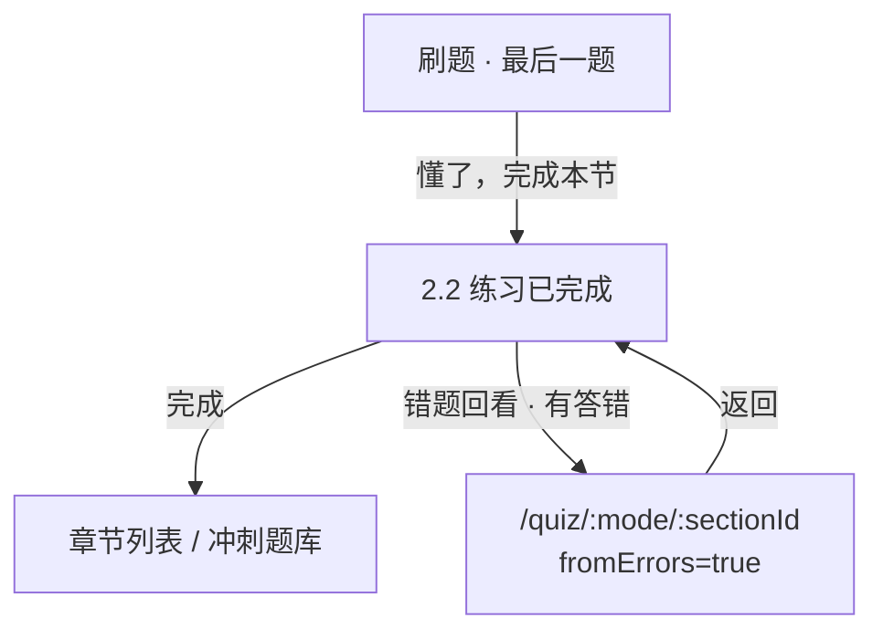

# 功能说明：刷题完成页 + 错题回看直达刷题（CHG-2026-06-01 / T-07）

> 本文件为 **工单必填附件**：FOCO 工单描述中须链接到本文件（GitHub blob 链接）。  
> 与工单同步维护；流程图用 **mermaid**。

---

## 基本信息

| 项 | 内容 |
|----|------|
| 功能 ID | **T-07** · CHG-2026-06-01 |
| 工期标签 | **P0** |
| 更新日期 | 2026-06-01 |

---

## 工程师链接（必填，须可点击）

| 类型 | 链接 |
|------|------|
| **Vercel 验收** | https://foco-iiqe.vercel.app/quiz/basic/1（做完最后一题 → 完成页 → 可选错题回看） |
| **GitHub Spec** | https://github.com/qingqingwu01official/foco-iiqe/tree/main/src/app/components |

## 教研 · 原型对照（不给工程师 Figma URL）

| 画板 | nodeId | 清单 |
|------|--------|------|
| 2.2 练习已完成 · 打基础 | `1516:1648` | `figma修改清单/2026-06-01.md` |
| 2.2 练习已完成 · 考前冲刺 | `1516:1672` | 同上 |

相关源码文件：

- `src/app/components/QuizPracticeCompletePage.tsx`
- `src/app/components/QuizPage.tsx`
- `src/app/utils/errorBookFocus.ts`
- `src/app/App.tsx`（路由 `/quiz/:mode/:id/complete`）

---

## 功能说明

本节刷题最后一题后，进入 **练习已完成** 页，展示本次答对/答错/正确率。用户可点「完成」返回章节列表或冲刺题库；若本次有答错，可点「错题回看」**直接进入错题刷题页**（`fromErrors`，顶栏「错题本」），无需经过错题本列表。

---

## 操作流程

步骤：

1. 用户在本节最后一题看完解析。
2. 进入完成页，查看统计；全对时不显示「错题回看」。
3. 有答错时点「错题回看」→ 错题刷题页（与错题本列表点节进入一致）。
4. 错题刷题页返回时回到完成页；点「完成」离开练习流。

---

## 本期范围

### In

- 完成页 UI（吉祥物、统计、双按钮）
- 打基础 / 冲刺双模式；落点映射（章 → `1a` 等；库+章 → `c-ch1` 等）
- `returnPath` 从错题刷题回到完成页

### Out

- 错题回看打开 `/errors` 列表
- 错题持久化真实数据（见 T-06；原型用会话统计）

---

## 验收要点
- [ ] 全对隐藏「错题回看」；有答错可点且直达错题刷题页
- [ ] 打基础第 1 章练习后回看落点 `1a`；冲刺「重中之重·第1章」落点 `c-ch1`

