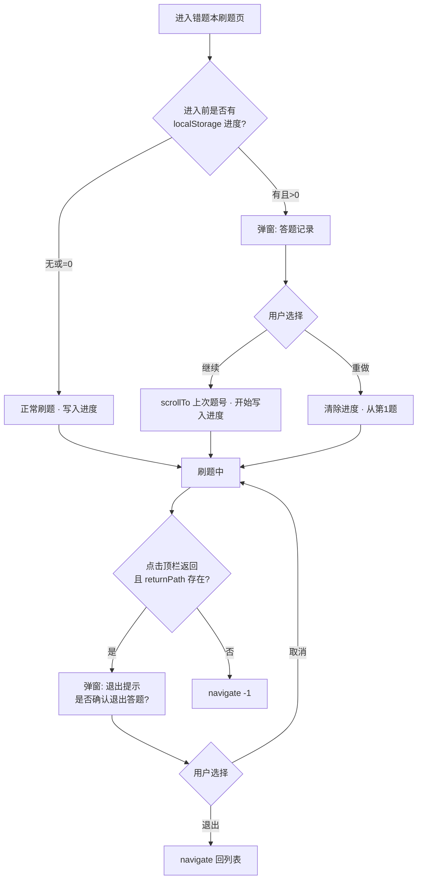

# 功能说明：刷题页弹窗 — 答题记录与退出提示（CHG-2026-06-02-B）

> 工单附件。专述错题本刷题（及同源刷题壳）上的**两种模态提示**与进度恢复逻辑。

---

## 基本信息

| 项 | 内容 |
|----|------|
| 功能 ID | **CHG-2026-06-02-B** |
| 工期标签 | **P0** |
| 更新日期 | 2026-06-02 |
| 生产部署 | `dpl_26ZtAiFk2nD1rsN15iSZ74WFitUm` |

---

## 工程师链接（必填）

| 类型 | 链接 |
|------|------|
| **Vercel 验收** | https://foco-iiqe.vercel.app/errors → 进入刷题 → 触发返回/再进入 |
| **GitHub Spec** | https://github.com/qingqingwu01official/foco-iiqe/blob/main/src/app/components/QuizPage.tsx |
| **存储 key** | `iiqe-quiz-progress-v1`（`QuizPage.tsx` 内 `QUIZ_PROGRESS_STORAGE_KEY`） |
| **关联功能说明** | https://github.com/qingqingwu01official/foco-iiqe/blob/main/docs/iiqe-feature-specs/错题本功能说明.md |

---

## 教研 · 原型对照

| 画板 | nodeId | 清单 |
|------|--------|------|
| 错题本刷题 · 答题记录 / 退出提示 | 第二版 C 区刷题壳 | `figma修改清单/CHANGELOG.md` |

---

## 考生视角

刷错题本中途若离开，下次再进同一小节时，系统问我是否从上次做到的第几题继续，还是重做。点返回回列表前，会确认是否退出答题，避免误触丢进度。

---

## 教研视角

「答题记录」= **中断续练**，只在再次进入时问一次，不打断同一次刷题。「退出提示」= **防误触离开**；文案用「答题」而非「答疑」，与 D-09 区分的答疑能力无关。

---

## 操作流程

---

## UI/UX 规范

| 弹窗 | 标题 | 副文案 | 按钮 | 布局 |
|------|------|--------|------|------|
| 答题记录 | 答题记录 | 检测到上次练习到第{X}题，是否继续？ | 重做 / 继续 | `QuizCenterDialog`：相对刷题页根 `absolute`，宽 100% 限 393px 壳层 |
| 退出提示 | 退出提示 | **是否确认退出答题？** | 取消 / 退出 | 同上 |

**时机铁律**

- 答题记录：仅**退出后再次进入**同一 `resumeProgressKey` 时弹；同一会话内**不得**再次触发。
- 进度写入：按「最远题号 + 是否已作答」（`{ index, touched }`）；已作答第 1 题但未点「下一题」也会续练提示；退出确认前强制落盘。
- 弹窗展示期间**暂停**写入 `localStorage`，用户选择后再恢复。

---

## 本期范围

### In

- `QuizCenterDialog` 组件化两种弹窗
- 进度 key：`${mode}:errors:${id}:${sectionName}:${libraryName}`
- 最后一题完成时清除进度
- 安全区 padding、`maxHeight` + 内容区可滚动

### Out

- 跨设备云同步进度（需后端）
- 章节刷题非错题本场景的退出策略变更（若无 `returnPath` 仍 `navigate(-1)`）

---

## 验收要点

- [ ] 做 2 题后回列表再进 → 弹「答题记录」，继续定位正确
- [ ] 同一次进入连刷多题 → 中途不弹答题记录
- [ ] 点返回 → 「是否确认退出答题？」；弹窗不超出手机壳宽度
- [ ] 重做后从第 1 题开始且旧进度清除
