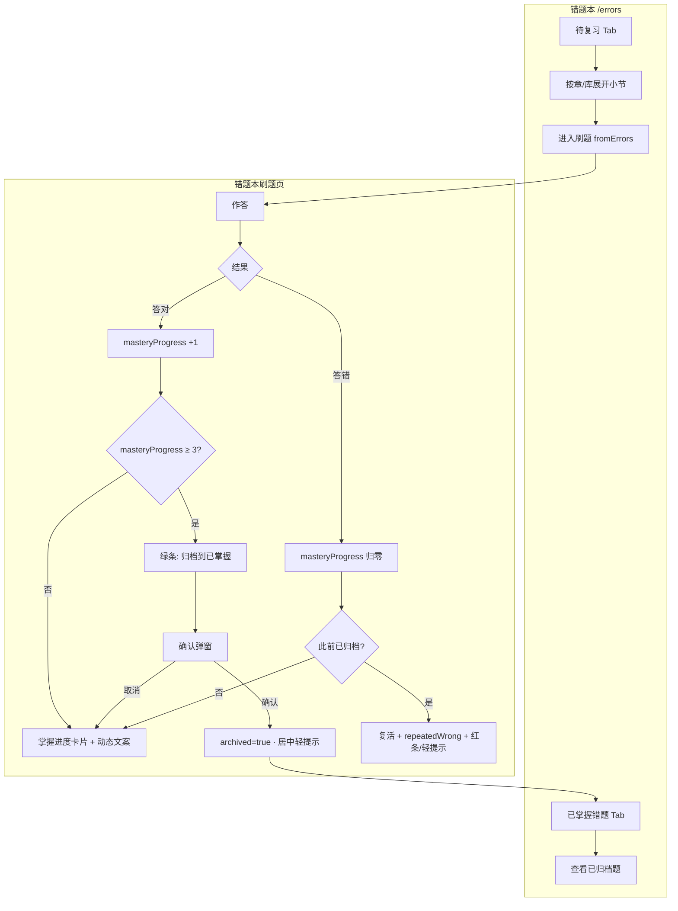

# 功能说明：错题本归档（移除）机制与前端表现（CHG-2026-06-02-A）

> **已合并至主文档**：工单 **CHG-2026-06-02-A** 以 [`FOCO_错题本功能说明.md`](./FOCO_错题本功能说明.md) 为准。本文档仅作历史摘要，不再单独维护。

---

## 基本信息

| 项 | 内容 |
|----|------|
| 功能 ID | **CHG-2026-06-02-A** |
| 工期标签 | **P0**（MVP 错题本掌握闭环） |
| 更新日期 | 2026-06-02 |
| 生产部署 | `dpl_26ZtAiFk2nD1rsN15iSZ74WFitUm` |

---

## 工程师链接（必填）

| 类型 | 链接 |
|------|------|
| **Vercel 验收（列表）** | https://foco-iiqe.vercel.app/errors |
| **Vercel 验收（刷题）** | https://foco-iiqe.vercel.app/errors → 进入任一带错题的小节 |
| **GitHub Spec（逻辑）** | https://github.com/qingqingwu01official/foco-iiqe/blob/main/src/app/lib/errorBookArchive.ts |
| **GitHub Spec（列表 UI）** | https://github.com/qingqingwu01official/foco-iiqe/blob/main/src/app/components/ErrorBookPage.tsx |
| **GitHub Spec（刷题 UI）** | https://github.com/qingqingwu01official/foco-iiqe/blob/main/src/app/components/QuizPage.tsx |
| **功能说明（总览）** | https://github.com/qingqingwu01official/foco-iiqe/blob/main/docs/iiqe-feature-specs/错题本功能说明.md |

---

## 教研 · 原型对照

| 画板 | nodeId | 清单 |
|------|--------|------|
| 错题本列表 / 刷题掌握进度区 | 以第二版全流程 C 区为准 | `figma修改清单/2026-06-02.md`、工作区 `FOCO_错题本功能说明.md` §四 |

---

## 考生视角

我在错题本里反复练错题，系统用「掌握进度」告诉我还要答对几次；达标后出现绿色「归档到已掌握」，确认后题进入「已掌握错题」档案。若已掌握的题我又答错，会提示复活并标「反复错」，提醒我这题是真薄弱点。

---

## 教研视角

「移除」= **归档至已掌握**，非删除；须连续掌握证据 + 用户确认。列表分 `待复习` / `已掌握错题`，与状态机一致。原型已实现 UI；工程需对齐持久化字段与 API（若脱离 localStorage）。

---

## 操作流程

---

## 本期范围

### In

- **掌握进度**：`masteryProgress` 0～3；三点指示；动态文案（再答对 X 次 / 已连续三次可归档 / 已归档）
- **归档**：绿底栏可点 → 确认弹窗 → 归档成功居中轻提示「已归档至已掌握」→ 再切下一题
- **复活**：已归档题再答错 → `archived=false`、`repeatedWrong=true`；轻提示「该题已复活回错题本」+ 红底栏「反复错…」
- **列表**：`待复习` / `已掌握错题`；已归档不进待复习；待复习 `共0题` 方框打勾；已掌握分段无方框
- **列表指标行**：X题还需做对1/2次、X题反复错（0 也显示，X题加粗）

### Out

- 跨 ≥3 个独立 Session 的后端强校验（产品目标见 `FOCO_错题本功能说明.md` §1.2；原型当前以 `masteryProgress≥3` 为准）
- 间隔复习 `nextReviewAt` 调度引擎
- 答题记录 / 退出提示弹窗（见 CHG-2026-06-02-B）

---

## 验收要点

- [ ] 连续答对 3 次（同会话）出现绿条，点击可归档，列表「已掌握错题」可见
- [ ] 不归档时题仍在「待复习」
- [ ] 已掌握题再答错：复活轻提示 + 反复错红条
- [ ] 列表七章四库骨架稳定；分段过滤正确
- [ ] 与 `errorBookArchive.ts` 字段一致（或 API 合同文档化）
