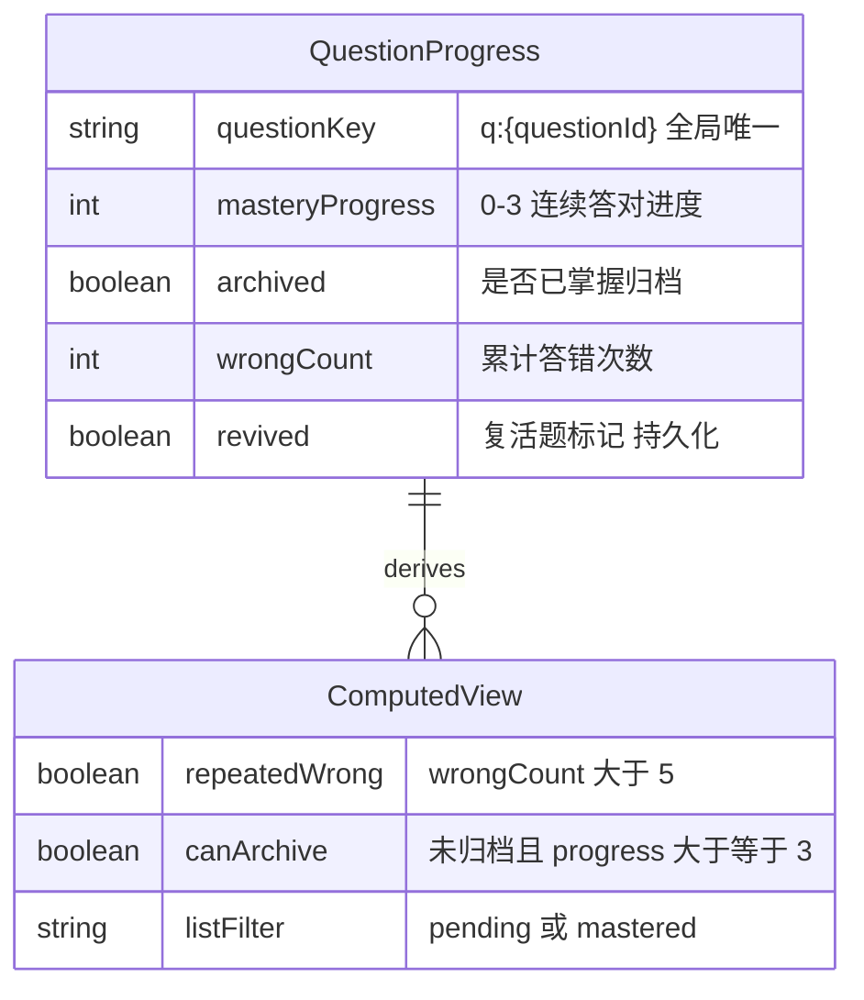
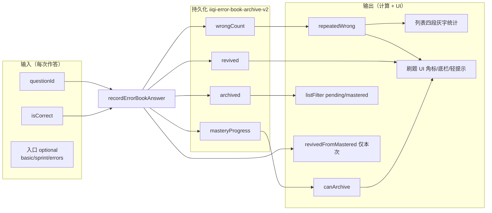
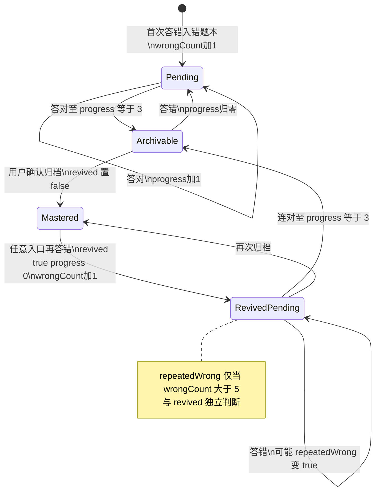
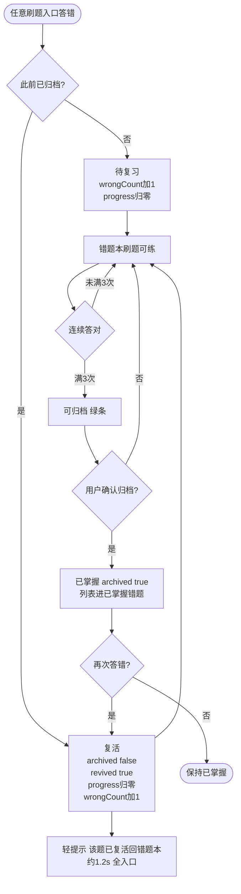
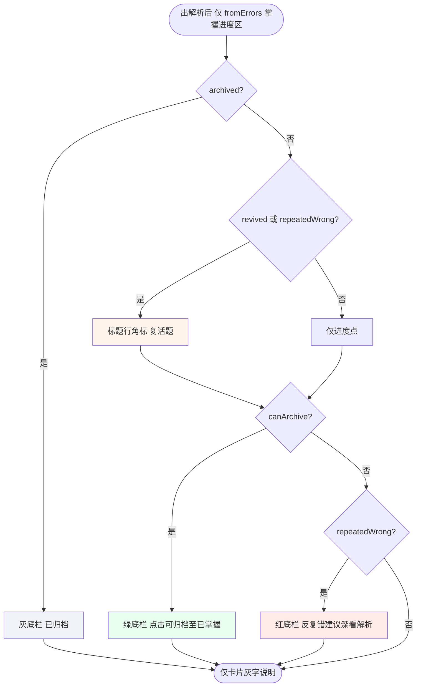
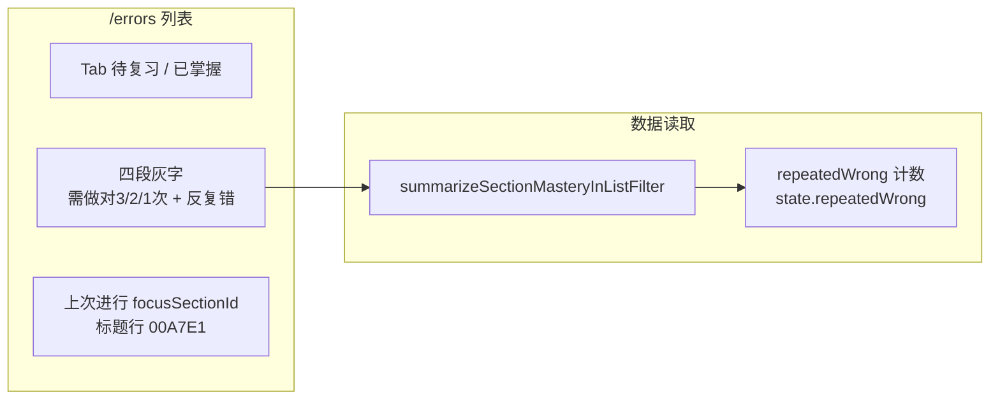

# 错题本 · 复活题与反复错 — 独立说明

> **用途**：专述「复活题」与「反复错」的概念、数据关系、输入输出与操作流程。  
> **对齐实现**：FOCO IIQE 原型 · https://foco-iiqe.vercel.app  
> **代码**：`src/app/lib/errorBookArchive.ts` · `src/app/components/QuizPage.tsx` · `src/app/components/ErrorBookPage.tsx`  
> **版本**：2026-06-03（与 `FOCO_错题本功能说明.md` v1.2 §1.4 一致）  
> **存储**：`localStorage` · key `iiqe-error-book-archive-v2` · 题目粒度 `q:{questionId}`（全局一份，不区分入口）

---

## 一、一句话区分

| 概念 | 一句话 |
|------|--------|
| **复活题** | 这道题**曾经归档到已掌握**，后来在任意刷题入口**又答错了**，回到待复习；数据上 `revived = true`。 |
| **反复错** | 这道题**累计答错超过 5 次**（第 6 次错起算）；数据上 `repeatedWrong = (wrongCount > 5)`。 |

**关键**：复活 **不会自动** 等于反复错。刚从未掌握复活时，往往 `revived=true` 且 `repeatedWrong=false`。

**包含关系**：

- 反复错 ⇒ 一定是复活题（实现上：错 >5 时答错也会把 `revived` 置 `true`）。
- 复活题 ⇏ 一定是反复错（刚从已掌握回来、累计错 ≤5 时很常见）。

---

## 二、持久化字段与计算字段

### 2.1 单题存储结构（`PersistedItemState`）

| 字段 | 类型 | 写入时机 | 说明 |
|------|------|----------|------|
| `masteryProgress` | `0 \| 1 \| 2 \| 3` | 每次答对 +1（未归档）；答错归零 | 掌握进度三点对应此值 |
| `archived` | `boolean` | 用户确认归档 → `true`；复活答错 → `false` | `true` 时题目在「已掌握错题」分段 |
| `wrongCount` | `number` | 每次答错 +1，**跨入口累计**，不归零 | 归档时保留历史值 |
| `revived` | `boolean` | 见 §三 | 复活题身份标记 |

### 2.2 运行时计算（`ErrorBookItemState`）

| 字段 | 计算规则 | 是否写入 localStorage |
|------|----------|------------------------|
| `repeatedWrong` | `wrongCount > 5`（常量 `REPEATED_WRONG_THRESHOLD = 5`） | 否，每次读取时算 |
| `canArchive` | `!archived && masteryProgress >= 3` | 否 |
| `bucket` | `archived` → `mastered`；否则 `masteryProgress>=3` → `archivable`；否则 `pending` | 否 |

### 2.3 列表分段规则

| 列表 Tab | 题目条件 |
|----------|----------|
| **待复习** | `archived === false` |
| **已掌握错题** | `archived === true` |

列表灰字 **「X题反复错」**：在当前 Tab 内，统计 `repeatedWrong === true` 的题数（与 `revived` 无直接计数关系）。

---

## 三、输入与状态变更（核心 API）

主入口：`recordErrorBookAnswer({ questionId, isCorrect })`  
辅助：`archiveErrorBookItem({ questionId })`

### 3.1 答对（`isCorrect = true`）

| 当前状态 | 输入 | 输出 / 下一状态 |
|----------|------|-----------------|
| 已归档 `archived=true` | 答对 | **不变**（不增加掌握进度） |
| 未跟踪且无记录 | 答对 | 可不写入（仍无跟踪） |
| 待复习 / 可归档 | 答对 | `masteryProgress +1`（上限 3），`archived` 保持 false |

### 3.2 答错（`isCorrect = false`）

| 当前状态 | 输入 | 输出 / 下一状态 |
|----------|------|-----------------|
| 已归档 `archived=true` | 答错 | **复活**：`archived→false`，`masteryProgress→0`，`wrongCount+1`，`revived→true`；返回 `revivedFromMastered=true` |
| 未归档 | 答错 | `masteryProgress→0`，`wrongCount+1`；若本次后 `wrongCount>5` 则 `revived→true`，否则保留原 `revived` |

**复活答错后的典型快照**（第一次从已掌握掉下来）：

```text
archived: false
masteryProgress: 0
wrongCount: 1（或原历史+1）
revived: true
repeatedWrong: false   // 因 wrongCount 仍 ≤ 5
```

### 3.3 归档（用户确认）

| 输入 | 输出 |
|------|------|
| 用户点击绿条并确认归档 | `masteryProgress=3`，`archived=true`，`revived=false`；`wrongCount` 保留 |

---

## 四、数据关系图

### 4.1 实体关系（逻辑字段）



### 4.2 输入输出数据流



### 4.3 状态机（归档 · 复活 · 反复错）



---

## 五、操作流程（Mermaid）

### 5.1 总览：从错到掌握再到复活



### 5.2 反复错判定与 UI 分支（错题本刷题页）



**底栏互斥（实现）**：同一时刻最多一条底栏 —— **绿（可归档）优先**，否则 **红（反复错）**；已归档仅 **灰（已归档）**。

### 5.3 列表页：统计与「上次进行」



---

## 六、刷题页 UI 映射表（与代码一致）

| UI 元素 | 显示条件（`QuizPage`） | 数据来源 |
|---------|------------------------|----------|
| 掌握进度区整体 | `fromErrors && sectionId` | 路由 state |
| 角标「复活题」 | `!archived && (revived \|\| repeatedWrong)` | `getErrorBookItemState` |
| 绿底栏 | `canArchive && !archived` | 同上 |
| 红底栏 | `!archived && !canArchive && repeatedWrong` | 同上 |
| 灰底栏「已归档」 | `archived` | 同上 |
| 轻提示「该题已复活回错题本」 | 本次 `revivedFromMastered` | `recordErrorBookAnswer` 返回值 |

---

## 七、输入输出对照表（速查）

| 事件 | 输入 | 持久化变更 | 计算输出 | 列表 | 错题本刷题 UI |
|------|------|------------|----------|------|----------------|
| 首次答错入本 | `isCorrect=false` | `wrongCount↑`, `progress=0` | `pending` | 待复习 +1 | 无掌握区（非错题本页） |
| 待复习答对 | `isCorrect=true` | `progress↑` | 可能 `canArchive` | 灰字「需做对 N 次」变 | 进度点 + 文案 |
| 确认归档 | 用户点击 | `archived=true`, `revived=false` | `mastered` | 移入已掌握 | 灰条「已归档」 |
| **已掌握再答错（复活）** | `isCorrect=false` | `archived=false`, `revived=true`, `progress=0`, `wrongCount↑` | 通常 `repeatedWrong=false` | 回待复习 | 角标 + 轻提示；**通常无红条** |
| 累计错 >5 后再错 | `isCorrect=false` | `wrongCount↑`, `revived=true` | `repeatedWrong=true` | 「反复错」+1 | 角标 + **红条**（不可归档时） |
| 复活后连对 3 次 | `isCorrect=true` | `progress→3` | `canArchive` | 仍待复习 | 绿条可归档 |

---

## 八、常见误解勘误

| 误解 | 实际（Vercel） |
|------|----------------|
| 复活后立刻变成反复错 | 仅 `revived=true`；`repeatedWrong` 要看 `wrongCount` 是否 >5 |
| 反复错 = 复活 | 反复错是错太多次；复活是曾掌握后又错 |
| 反复错用橙色底栏 | 已取消；反复错用**红底栏**，复活用**标题角标** |
| 任意入口展示掌握进度 | **仅**错题本刷题页（`fromErrors` + `sectionId`） |
| 复活只在错题本触发 | **数据**任意入口答错都会复活；**轻提示**任意入口；**角标/底栏**仅错题本页 |

---

## 九、关联文档

| 文档 | 关系 |
|------|------|
| [FOCO_错题本功能说明.md](./FOCO_错题本功能说明.md) | 全功能主文档 · §1.4 摘要 |
| [CHG-2026-06-02-错题本归档移除与前端表现.md](./前端代码/docs/iiqe-feature-specs/CHG-2026-06-02-错题本归档移除与前端表现.md) | 工单 A |
| [CHG-2026-06-02-刷题弹窗-答题记录与退出提示.md](./前端代码/docs/iiqe-feature-specs/CHG-2026-06-02-刷题弹窗-答题记录与退出提示.md) | 工单 B（答题记录/退出，与复活独立） |

**GitHub Spec**：https://github.com/qingqingwu01official/foco-iiqe/blob/main/docs/iiqe-feature-specs/

---

## 十、修订记录

| 日期 | 说明 |
|------|------|
| 2026-06-03 | 初版：按 `errorBookArchive.ts` / `QuizPage.tsx` 整理独立说明 |
