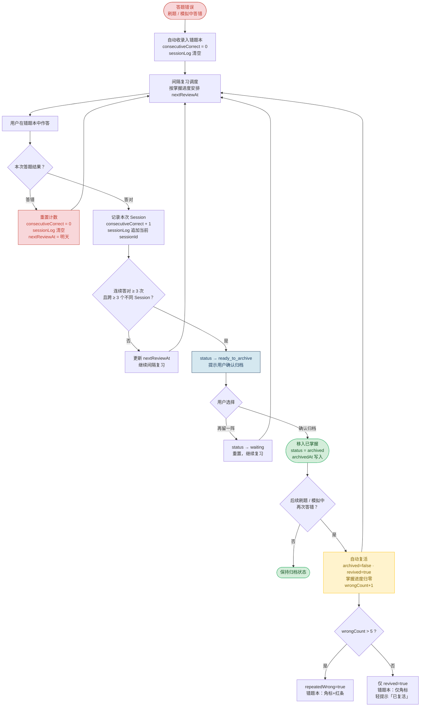
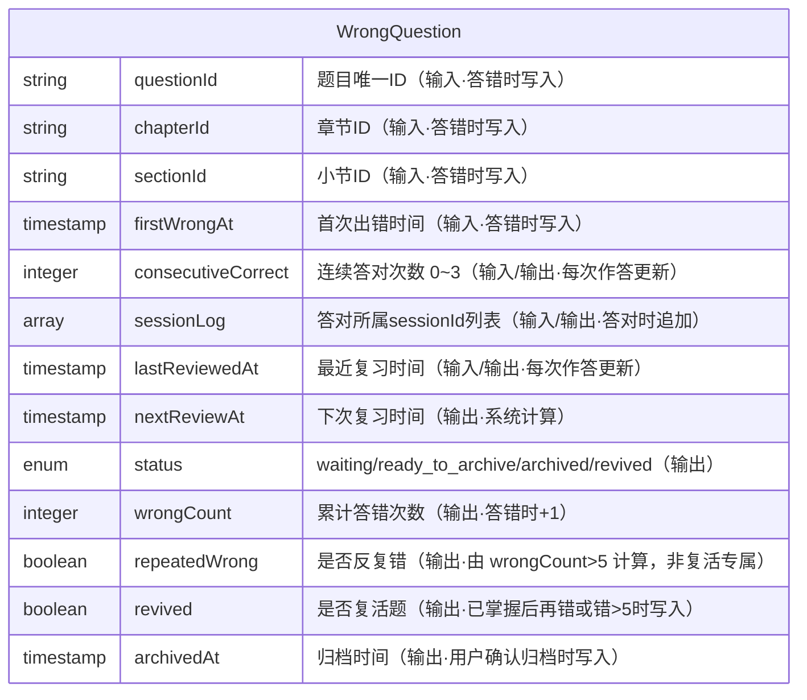
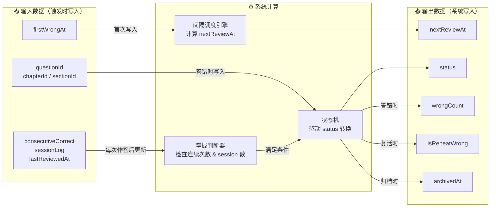
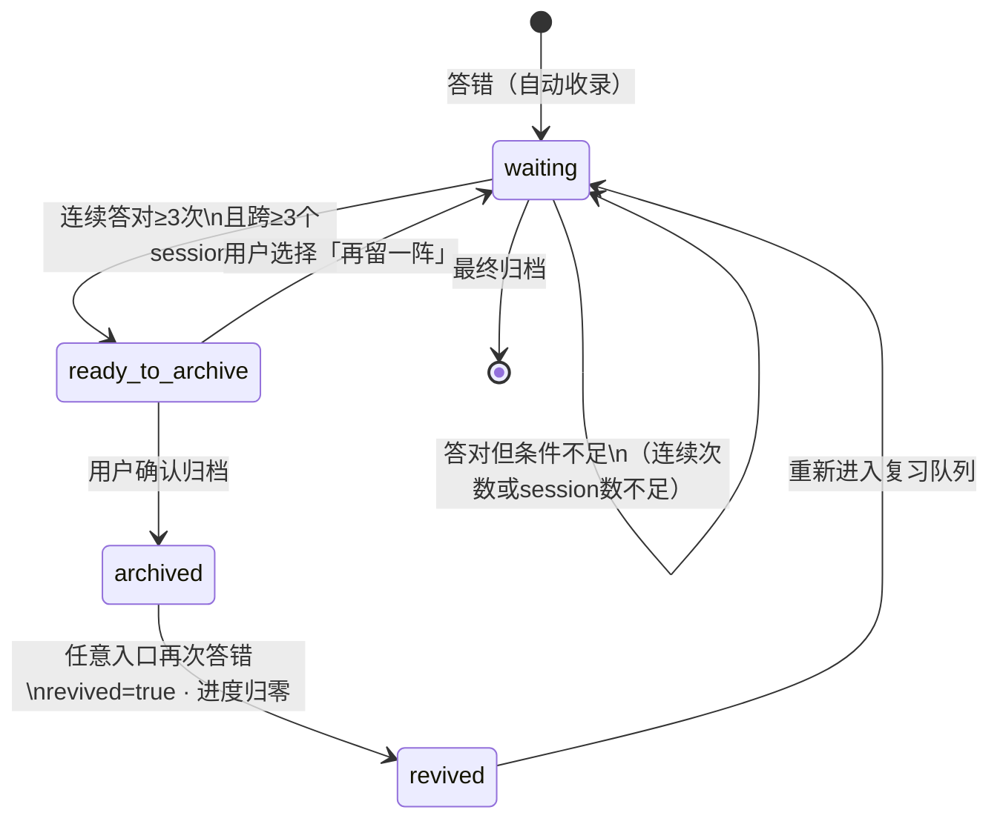

# FOCO 备考 · 错题本功能说明文档

> 适用版本：FOCO IIQE 备考 · 文档版本：**v1.2**（2026-06-03）  
> 当前生产：https://foco-iiqe.vercel.app · `dpl_4NnwQRxz2vJeYL344evHH6PSDki2`（答题记录）及后续部署

---

## 一、功能概述

错题本是 FOCO 备考的核心学习功能，帮助考生高效利用「错误信息」，将薄弱题目通过间隔复习转化为稳固掌握，而非无限刷新题目。

> **设计原则**：移除（归档）不应由用户手动决定，而应由系统根据「掌握证据」自动判断。用户在整个流程中只需做一件事——答题后告诉系统「会了」还是「还不会」。

### 1.1 核心概念定义


| 术语                              | 定义                                                     |
| ------------------------------- | ------------------------------------------------------ |
| **连续正确次数** `consecutiveCorrect` | 针对同一题，在错题本复习中连续答对的次数。答错一次立即归零                          |
| **独立复习 Session**                | 每次打开 App 进行复习视为一个独立 Session。同一 Session 内多次答对同一题，仅计 1 次 |
| **归档** Archive                  | 满足掌握条件后，将题目从「待复习」移入「已掌握」档案区，保留历史，可随时复查                 |
| **复活** Revive                   | 已归档题目在**任意刷题入口**再次答错 → 回到「待复习」、`revived=true`、掌握进度归零；**不等于**立刻变成反复错 |
| **反复错** Repeated wrong         | 该题**累计答错 > 5 次**（`wrongCount > 5`）；列表统计与红底栏均据此判断；达阈值时也会置 `revived=true` |


### 1.2 归档触发条件

同时满足以下两个条件，系统向用户提示归档：

- **条件 A**：连续正确次数 ≥ 3 次
- **条件 B**：3 次答对分布在 ≥ 3 个不同的独立复习 Session 中

条件 B 防止用户在同一时段连刷三遍蒙混过关（短期记忆效应），同时替代了固定天数门槛，对 IIQE 7 天短期备考用户友好。

### 1.3 功能详述

- 核心思路是：移除不应该是人工操作，而应该是系统根据"掌握证据"自动决策。
- 移除逻辑：两层门槛叠加
第一层：连续正确次数（≥3次）
一道题不能因为"偶然答对一次"就被移除。至少要连续正确 3 次，才说明这不是猜对的，而是真的会了。答错一次就归零重计。
应避免的机制：防的是「一口气连刷3遍」的短期记忆效应
"复习间隔"：
  > 第3次正确答题时，距离第1次正确答题的间隔 ≥ 2次独立复习session
  > 第二层：用户主动确认
  > 不要让系统静默删题。弹一个轻量提示："你已连续答对三次，可归档至已掌握" 给用户感知和控制权，同时也让"归档"这个动作有仪式感——强化正向反馈，这本身也是学习动机设计的一部分。不要"删除"，要"归档"。 移除出错题本不等于永久删除。放入「已掌握」档案区，用户随时可以翻回去复查。
- **「复活」规则（与 Vercel 一致）**：已掌握题再答错 → 自动回到待复习、写入 `revived`；**不**在复活瞬间强制标「反复错」。仅当累计答错已超过 5 次时，才同时满足「反复错」。

### 1.4 复活题 vs 反复错（概念对照 · 对齐 `errorBookArchive.ts`）

> **独立详版**（含 ER/数据流/状态机/操作流程 mermaid）：[`FOCO_错题本-复活题与反复错说明.md`](./FOCO_错题本-复活题与反复错说明.md)

二者是**两个独立字段**，不要混成「复活 = 反复错」。

| 维度 | **复活题** `revived` | **反复错** `repeatedWrong` |
|------|----------------------|----------------------------|
| **含义** | 曾归档到已掌握后，在任意入口又答错，回到待复习 | 累计答错超过 5 次（第 6 次错起），含一直未归档的顽固错 |
| **何时写入** | **仅**已掌握后再答错时置 `true`；归档时清 `false` | 每次作答后**计算**：`wrongCount > 5`（**不写** `revived`） |
| **是否持久** | 存 localStorage，未归档前可保持 `true` | 不单独存字段，由 `wrongCount` 推导 |
| **列表灰字「X题反复错」** | 不计入 | 计入 `repeatedWrong` 统计 |
| **刷题页 UI** | 标题行橙色角标「复活题」 | 不可归档时出现**红底栏**文案 |

**关系（当前实现 · 无叠加）**：

- **复活题 ⇏ 反复错**：刚从已掌握复活、累计错 ≤5：`revived=true`，`repeatedWrong=false`。
- **反复错 ⇏ 复活题**：一直在待复习错到第 6 次及以上、从未归档：仅 `repeatedWrong=true`，`revived=false`，无「复活题」角标。
- **可同时成立**：曾掌握后复活，且历史累计错已 >5 → 角标 + 红条并存，仍是两个字段各自判断。

**从「已掌握」答错复活时，数据变化**（`recordErrorBookAnswer`）：

```
archived: true → false
masteryProgress → 0
wrongCount += 1
revived → true
repeatedWrong → 仅当 wrongCount > 5
```

**刷题页展示（仅错题本 `fromErrors` 掌握进度区）**：

| 场景 | 角标「复活题」 | 红底栏「反复错…」 | 居中轻提示 |
|------|----------------|-------------------|------------|
| 刚从未掌握复活（错 ≤5 次） | ✅ | ❌ | ✅「该题已复活回错题本」（任意入口答错均可） |
| 仅反复错（未归档、错>5） | ❌ | ✅ | ❌ |
| 复活且反复错 | ✅ | ✅ | 视是否本次从已掌握复活 |
| 可归档（连对 3 次） | 若仍 revived | ❌（优先绿条） | — |
| 已点归档 | ❌ | ❌ | 灰条「已归档」 |

---

## 二、操作功能流程




### 流程关键说明

**答错重置规则**：`consecutiveCorrect` 归零，`wrongCount` 累计不归零；`sessionLog` 清空，需重新跨 session 积累。

**复活路径（已掌握后再错）**：任意入口答错 → `revived=true`、回待复习、掌握进度归零；全入口可轻提示「该题已复活回错题本」。错题本刷题页显示标题角标「复活题」；**仅当** `wrongCount > 5` 且不可归档时再加红底栏「反复错…」。之后重新连对 3 次 → 绿条可归档。

---

## 三、数据输入输出关系

### 3.1 核心数据字段




### 3.2 数据流向关系




### 3.3 状态机转换




---

---

## 四、考生视角 & UI/UX（前端设计与细节说明）

> 本章节面向「考生体验/教研验收/前端实现」三方共识：在不改变前述逻辑与规则的前提下，明确**页面结构、信息层级、关键交互、状态反馈、文案与边界**，避免“规则正确但体验含糊”。

### 4.1 考生视角：我在用错题本做什么？

错题本对考生来说不是“清空列表”的任务，而是一个**可预期的复习闭环**：

- **目标**：把做错过的题，从“偶然记住”转成“稳固掌握”（需要跨时段证据）。
- **策略**：我只需要持续刷错题；系统用「掌握证据」告诉我什么时候可以归档，什么时候需要加深理解（反复错）。
- **结果**：
  - 做对积累到阈值 → 我能看到明确的掌握进度与可归档动作；
  - 归档后并非“永久删除” → 后续答错会自动复活，提醒我这题是真薄弱点。

### 4.2 信息架构：两段列表 + 一条刷题主线

#### 4.2.1 列表页（错题本 `/errors`）

列表页承担 3 件事：

1. **定位范围**：我现在要复习哪一章/哪一小节/哪一题库。
2. **预估成本**：这一块大概有多少错题、掌握难度分布如何（还需做对 3 / 2 / 1 次、反复错）。
3. **快速进入刷题**：点小节直接进入该小节的错题刷题队列。

UI 约束（建议/对齐当前原型实现方式）：

- **两段 Tab**：`待复习` / `已掌握错题`
  - `待复习`：偏“待办”，强调还有多少题需要刷。
  - `已掌握错题`：偏“档案”，强调可回看，但不承诺“完成态”。
- **行结构**：章节/小节行保持骨架稳定（避免切换筛选导致“章节消失”被误解为丢数据）。
- **右侧方框语义**：
  - 在 `待复习` 下：当该行 `共0题` 时显示完成态（深色底 + 勾）。
  - 在 `已掌握错题` 下：不显示方框（避免把档案页做成“完成清单”）。
- **待复习 · 四段灰字**（装饰线下方，单行 `space-between`、不换行、落在章节行宽内）：
  - `{X}题需做对3次` · `{X}题需做对2次` · `{X}题需做对1次` · `{X}题反复错`
  - `X` 为当前分段内统计题数（**0 也展示**），「X题」加粗；字号约 10px。
  - 含义：`需做对 N 次` = 距归档还差 N 次连续答对；`反复错` = 累计答错 **> 5 次**（与复活题独立统计）。

#### 4.2.2 刷题页（从错题本进入的 `/quiz/:mode/:id`，携带 `fromErrors=true`）

刷题页承担 3 件事：

1. **做题**：题干 + 选项 + 解析。
2. **掌握反馈**：通过「掌握进度卡片」告诉我还差几次能归档。
3. **异常提示**：复活题用角标标识；反复错（错 >5 次）用红底栏建议深看解析。

### 4.3 关键组件与交互细节（以“用户能感知的变化”为主）

#### 4.3.1 掌握进度卡片（Mastery Card）

**位置**：每题解析区内（通常在选择并展示解析后出现）。  
**内容**：

- 标题：`掌握进度`
- 三个点：对应 0/1/2/3 的掌握进度（以 `consecutiveCorrect`/`masteryProgress` 映射）
- 文案（动态）：  
  - 未达标：`再答对 X 次即可归档至已掌握`（X = 3 - masteryProgress）  
  - 达标：`你已连续答对三次，可归档至已掌握`  
  - 已归档：`已归档到已掌握`（已归档至已掌握的题目自动移入「已掌握错题」中）

**设计意图**：

- 卡片是“解释系统判断”的地方：让考生知道自己为何接近掌握，而不是只给一个神秘按钮。
- 进度点用于“低成本感知”：不用读长文也能看懂阶段。

**与下方提示条的叠层（刷题页）**：

- 掌握进度框 `z-index` 高于提示条，**下沿圆角（14px）压住提示条上缘**（提示条 `margin-top: -14px` 上移叠入）。
- 提示条总高 **44px**；文案在「掌握进度下边框」与「提示条下边框」之间的**可见带**内垂直居中（`padding-top: 14px` + flex 居中），保证文字不被圆角裁切、完整可读。
- 底栏**至多一条**：可归档绿条与反复错红条**互斥**（优先展示可归档）；复活题不用底栏。

#### 4.3.2 归档动作（绿色底栏，可点击）

当满足归档条件（连续答对≥3 次且跨 ≥3 个独立 session）时：

- **展示方式**：在掌握进度卡片下方出现一条**绿色提示底栏**（高度约 44px），整条可点击。
- **文案**：`点击可归档至已掌握`（归档中显示 `归档中...`）。
- **交互**：点击后弹出归档确认弹窗；确认后底栏变为**浅灰**、文案 **「已归档」**（不可点），题目写入 `archived` 并从列表「待复习」计入「已掌握错题」；居中轻提示后可选进入下一题。

**设计意图**：

- 与“反复错红条”同构：统一为“卡片（解释）+ 底栏（动作/建议）”的语言。
- 绿色表达正向可行动，且整条可点，提高发现率（比小按钮更符合移动端可触达性）。

#### 4.3.3 按题跟踪（全入口一致）

- **跟踪粒度**：按 **题目 ID** 全局一份状态，不区分章节刷题 / 分重点刷题 / 错题本待复习 / 已掌握。
- **统一规则**：答对累计 3 次可归档；答错 1 次掌握进度归零；已掌握后再答错 → 复活（进度归零、回到待复习）。
- **状态写入**：任意刷题入口作答均调用同一套 `recordErrorBookAnswer`（章节 / 分重点 / 错题本一致）。
- **掌握进度区展示**：**仅错题本所属刷题页**在出解析后显示掌握进度卡及底栏（绿 / 红 / 灰）；章节或分重点刷题页不展示该区，但后台仍累计进度/复活/反复错。
- **复活轻提示**：非错题本页答错触发复活时，仍可出现居中轻提示「该题已复活回错题本」（约 1.2s），不展示掌握进度卡片。

#### 4.3.4 复活题（标题角标）+ 反复错（红色底栏）

与 §1.4 一致；以下为 UI 触发条件（`QuizPage.tsx`）：

| 展示 | 触发（代码） | 位置 | 样式 |
|------|-------------|------|------|
| **复活题** | 未归档且 `revived` | 掌握进度标题行右对齐 | 橙色胶囊「复活题」 |
| **可归档** | `canArchive` 且未归档 | 绿色可点击底栏 | §4.3.2 |
| **反复错** | 未归档、不可归档、且 `repeatedWrong` | 红色底栏 | 反复错，建议深入看解析/找老师答疑 |
| **已归档** | `archived` | 浅灰底栏 | 已归档 |

- **底栏互斥（未归档）**：绿条优先；无绿条时才显示红条。
- **瞬时反馈（复活）**：`revivedFromMastered` 时全入口轻提示「该题已复活回错题本」（约 1.2s）；与是否显示红条无关。

**设计意图**：复活 = 身份（角标，仅 `revived`）；反复错 = 风险（红条，仅 `repeatedWrong`）；仅当两条件同时满足时才并存，**不**因反复错自动获得复活角标。

### 4.3.5 工程师链接（Spec 仓）


| 类型              | 链接                                                                                                                                                                                                         |
| --------------- | ---------------------------------------------------------------------------------------------------------------------------------------------------------------------------------------------------------- |
| **GitHub 功能说明** | [https://github.com/qingqingwu01official/foco-iiqe/blob/main/docs/iiqe-feature-specs/FOCO_错题本功能说明.md](https://github.com/qingqingwu01official/foco-iiqe/blob/main/docs/iiqe-feature-specs/FOCO_错题本功能说明.md) |
| **Vercel 列表**   | [https://foco-iiqe.vercel.app/errors](https://foco-iiqe.vercel.app/errors)                                                                                                                                 |
| **实现**          | `src/app/lib/errorBookArchive.ts` · `ErrorBookPage.tsx` · `QuizPage.tsx`                                                                                                                                   |


### 4.4 文案与语气（建议统一口径）

- **“归档/已掌握/复活/反复错”**：始终用同一组词，避免同义替换造成误解。
- **提示分层**：  
  - 规则解释 → 掌握进度卡片灰字  
  - 可行动 → 绿色底栏  
  - 高风险/需深看 → 红色底栏  
  - 状态变更瞬时告知 → 居中轻提示

### 4.5 视觉与交互可用性约束（移动端）

- **避免遮挡题干**：toast/轻提示不占题干区域；
- **一致性**：错题本刷题页壳层与章节刷题/分重点刷题一致（标题区仅文案区分场景）。

---

## 五、附注

### 5.1 间隔复习调度参考规则

目前小程序的错题本的测试效果是，进入本节错题本答对之后，退出刷题界面，再重新进来答对，累计答对3次，即可移除此题。目前先沿用此种间隔刷题策略。

> 此间隔规则为简化版，适配 IIQE 7 天短期备考场景。如备考周期延长，可引入标准 SM-2 算法（Ease Factor 动态调整）替代固定间隔。

### 5.2 前端名词对照


| 前端显示       | 文档术语                | 说明                     |
| ---------- | ------------------- | ---------------------- |
| 待复习        | `status = waiting`  | 在错题本复习队列中              |
| 已掌握错题      | `status = archived` | 已归档，暂不出现在复习队列          |
| 复活题        | `revived = true`    | 已掌握后再错必 true；错 >5 次也会 true；**不**等价反复错 |
| 反复错        | `wrongCount > 5`    | 累计答错超过 5 次；列表灰字与红条用此条件 |
| 掌握进度 `···` | `masteryProgress`   | 三点对应 0 / 1 / 2 / 3 次答对 |
| 列表四段灰字     | `needThreeMore` 等   | 需做对 3/2/1 次、反复错题数      |


