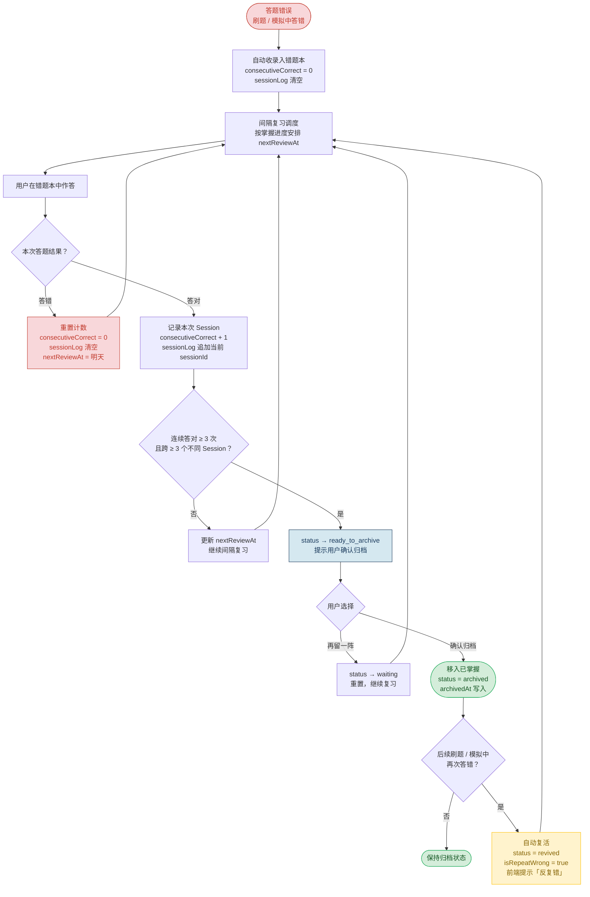
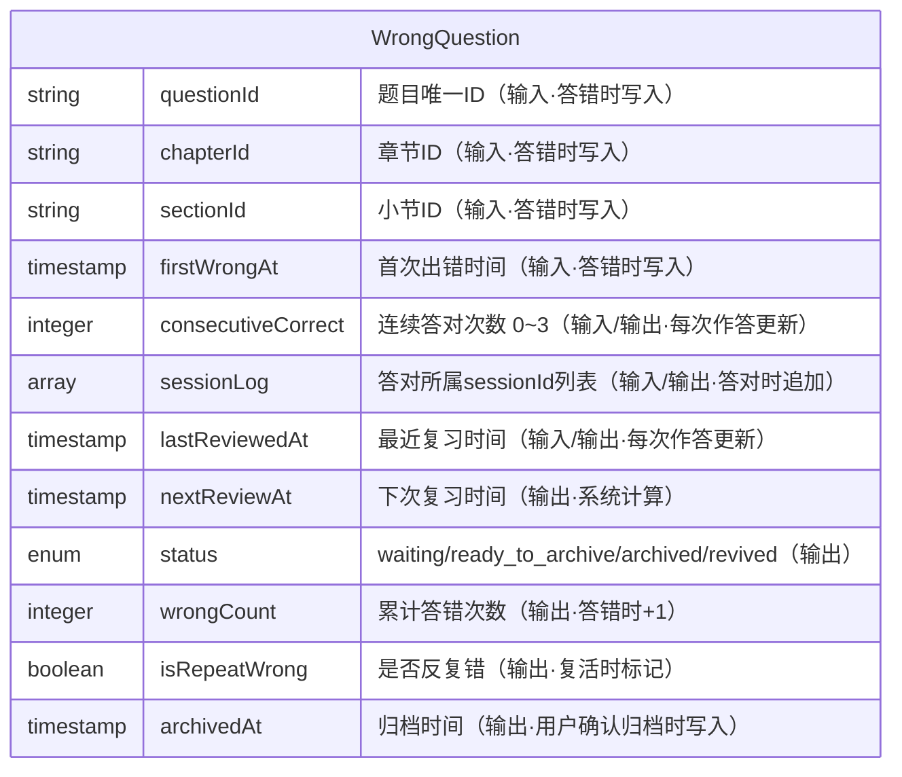
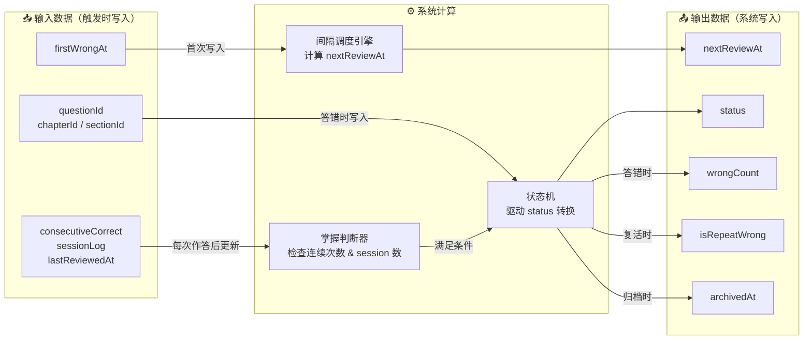
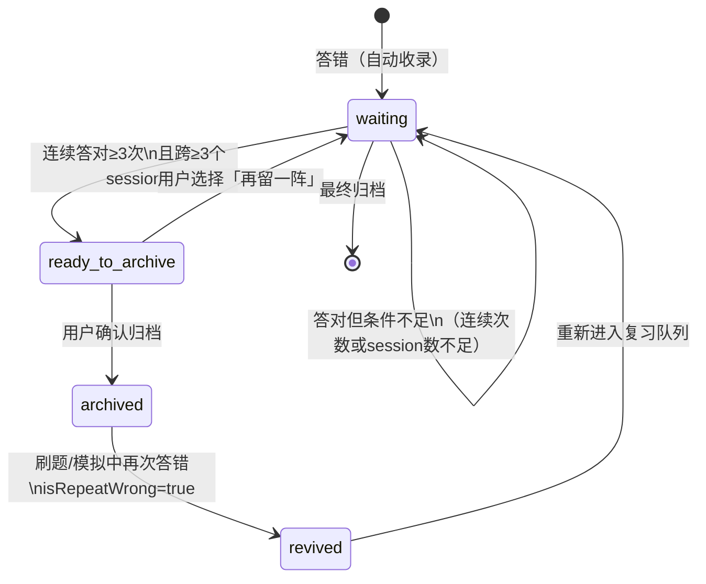

# FOCO 备考 · 错题本功能说明文档

> 适用版本：FOCO IIQE 备考 · 文档版本：v1.1（2026-06-02）

---

## 一、功能概述

错题本是 FOCO 备考的核心学习功能，帮助考生高效利用「错误信息」，将薄弱题目通过间隔复习转化为稳固掌握，而非无限刷新题目。

> **设计原则**：移除（归档）不应由用户手动决定，而应由系统根据「掌握证据」自动判断。用户在整个流程中只需做一件事——答题后告诉系统「会了」还是「还不会」。

### 1.1 核心概念定义

| 术语                              | 定义                                                     |
| ------------------------------- | ------------------------------------------------------ |
| **连续正确次数** `consecutiveCorrect` | 针对同一题，在错题本复习中连续答对的次数。答错一次立即归零                          |
| **独立复习 Session**                | 每次打开 App 进行复习视为一个独立 Session。同一 Session 内多次答对同一题，仅计 1 次 |
| **归档** Archive                  | 满足掌握条件后，将题目从「待复习」移入「已掌握」档案区，保留历史，可随时复查                 |
| **复活** Revive                   | 已归档题目若在刷题或模拟中再次答错，系统自动将其放回错题本，并标记为「反复错」                |

### 1.2 归档触发条件

同时满足以下两个条件，系统向用户提示归档：

- **条件 A**：连续正确次数 ≥ 3 次
- **条件 B**：3 次答对分布在 ≥ 3 个不同的独立复习 Session 中

条件 B 防止用户在同一时段连刷三遍蒙混过关（短期记忆效应），同时替代了固定天数门槛，对 IIQE 7 天短期备考用户友好。

### 1.3 功能详述

- 核心思路是：移除不应该是人工操作，而应该是系统根据"掌握证据"自动决策。
- 移除逻辑：两层门槛叠加
第一层：连续正确次数（≥3次）
一道题不能因为"偶然答对一次"就被移除。至少要连续正确 3 次，才说明这不是猜对的，而是真的会了。答错一次就归零重计。
应避免的机制：防的是「一口气连刷3遍」的短期记忆效应
"复习间隔"：
  > 第3次正确答题时，距离第1次正确答题的间隔 ≥ 2次独立复习session
  > 第二层：用户主动确认
  > 不要让系统静默删题。弹一个轻量提示："你已连续答对三次，可归档至已掌握" 给用户感知和控制权，同时也让"归档"这个动作有仪式感——强化正向反馈，这本身也是学习动机设计的一部分。不要"删除"，要"归档"。 移除出错题本不等于永久删除。放入「已掌握」档案区，用户随时可以翻回去复查。
- 「复活」规则：
保留复活机制。 如果同一道题或同类型题目在后续测试中再次答错，系统应该自动把它从归档中"复活"回错题本，并标记为"反复错"。这对于识别真正的薄弱点有价值。

---

## 二、操作功能流程

### 流程关键说明

**答错重置规则**：`consecutiveCorrect` 归零，`wrongCount` 累计不归零；`sessionLog` 清空，需重新跨 session 积累。

**反复错路径**：归档后在刷题/模拟中再次答错 → 自动复活，`isRepeatWrong = true` → 前端展示「反复错，建议深入看解析/找老师答疑」→ 重新走归档流程。

---

## 三、数据输入输出关系

### 3.1 核心数据字段

### 3.2 数据流向关系

### 3.3 状态机转换

---

---

## 四、考生视角 & UI/UX（前端设计与细节说明）

> 本章节面向「考生体验/教研验收/前端实现」三方共识：在不改变前述逻辑与规则的前提下，明确**页面结构、信息层级、关键交互、状态反馈、文案与边界**，避免“规则正确但体验含糊”。

### 4.1 考生视角：我在用错题本做什么？

错题本对考生来说不是“清空列表”的任务，而是一个**可预期的复习闭环**：

- **目标**：把做错过的题，从“偶然记住”转成“稳固掌握”（需要跨时段证据）。
- **策略**：我只需要持续刷错题；系统用「掌握证据」告诉我什么时候可以归档，什么时候需要加深理解（反复错）。
- **结果**：
  - 做对积累到阈值 → 我能看到明确的掌握进度与可归档动作；
  - 归档后并非“永久删除” → 后续答错会自动复活，提醒我这题是真薄弱点。

### 4.2 信息架构：两段列表 + 一条刷题主线

#### 4.2.1 列表页（错题本 `/errors`）

列表页承担 3 件事：

1. **定位范围**：我现在要复习哪一章/哪一小节/哪一题库。  
2. **预估成本**：这一块大概有多少错题、掌握难度分布如何（还需做对 3 / 2 / 1 次、反复错）。  
3. **快速进入刷题**：点小节直接进入该小节的错题刷题队列。

UI 约束（建议/对齐当前原型实现方式）：

- **两段 Tab**：`待复习` / `已掌握错题`
  - `待复习`：偏“待办”，强调还有多少题需要刷。
  - `已掌握错题`：偏“档案”，强调可回看，但不承诺“完成态”。
- **行结构**：章节/小节行保持骨架稳定（避免切换筛选导致“章节消失”被误解为丢数据）。
- **右侧方框语义**：
  - 在 `待复习` 下：当该行 `共0题` 时显示完成态（深色底 + 勾）。
  - 在 `已掌握错题` 下：不显示方框（避免把档案页做成“完成清单”）。
- **待复习 · 四段灰字**（装饰线下方，单行不换行、不溢出章节行宽）：
  - `{X}题需做对3次` · `{X}题需做对2次` · `{X}题需做对1次` · `{X}题反复错`
  - `X` 为当前分段内统计题数（**0 也展示**），「X题」加粗；字号约 10px、`gap` 收紧，四段 `space-between` 落在行内。
  - 含义：`需做对 N 次` = 距归档还差 N 次连续答对（`masteryProgress` 为 `3-N`）；`反复错` = 累计答错 **> 5 次**（与复活题独立）。

#### 4.2.2 刷题页（从错题本进入的 `/quiz/:mode/:id`，携带 `fromErrors=true`）

刷题页承担 3 件事：

1. **做题**：题干 + 选项 + 解析。  
2. **掌握反馈**：通过「掌握进度卡片」告诉我还差几次能归档。  
3. **异常提示**：复活题（反复错）需要更强提示与建议动作。

### 4.3 关键组件与交互细节（以“用户能感知的变化”为主）

#### 4.3.1 掌握进度卡片（Mastery Card）

**位置**：每题解析区内（通常在选择并展示解析后出现）。  
**内容**：

- 标题：`掌握进度`
- 三个点：对应 0/1/2/3 的掌握进度（以 `consecutiveCorrect`/`masteryProgress` 映射）
- 文案（动态）：  
  - 未达标：`再答对 X 次即可归档至已掌握`（X = 3 - masteryProgress）  
  - 达标：`你已连续答对三次，可归档至已掌握`  
  - 已归档：`已归档到已掌握`（已归档至已掌握的题目自动移入「已掌握错题」中）

**设计意图**：

- 卡片是“解释系统判断”的地方：让考生知道自己为何接近掌握，而不是只给一个神秘按钮。
- 进度点用于“低成本感知”：不用读长文也能看懂阶段。

**与下方提示条的叠层（刷题页）**：

- 掌握进度框 `z-index` 高于提示条，**下沿圆角（14px）压住提示条上缘**（提示条 `margin-top: -14px` 上移叠入）。
- 提示条总高 **44px**；文案在「掌握进度下边框」与「提示条下边框」之间的**可见带**内垂直居中（`padding-top: 14px` + flex 居中），保证文字不被圆角裁切、完整可读。
- 多条提示条（绿 / 橙 / 红）时仅最底一条保留下圆角；上层条无下圆角。

#### 4.3.2 归档动作（绿色底栏，可点击）

当满足归档条件（连续答对≥3 次且跨 ≥3 个独立 session）时：

- **展示方式**：在掌握进度卡片下方出现一条**绿色提示底栏**（高度约 44px），整条可点击。
- **文案**：`归档到已掌握`（归档中显示 `归档中...`）。
- **交互**：点击后弹出归档确认弹窗；确认归档成功后给“居中轻提示”，并在提示结束后再进入下一题（避免提示串到下一题题干）。

**设计意图**：

- 与“反复错红条”同构：统一为“卡片（解释）+ 底栏（动作/建议）”的语言。
- 绿色表达正向可行动，且整条可点，提高发现率（比小按钮更符合移动端可触达性）。

#### 4.3.3 按题跟踪（全入口一致）

- **跟踪粒度**：按 **题目 ID** 全局一份状态，不区分章节刷题 / 分重点刷题 / 错题本待复习 / 已掌握。
- **统一规则**：答对累计 3 次可归档；答错 1 次掌握进度归零；已掌握后再答错 → 复活（进度归零、回到待复习）。
- **掌握进度区展示**：凡该题已有错题本记录，在任意刷题页作答并出解析后均显示「掌握进度」卡片（不限错题本入口）。

#### 4.3.4 复活题（橙色底栏）+ 反复错（红色底栏）

| 类型 | 触发条件 | 底栏颜色 | 文案 |
|------|----------|----------|------|
| **复活题** | 已归档后在任意刷题页再次答错 | 橙色 | 复活题，加强巩固可掌握 |
| **反复错** | 该题累计答错 **> 5 次** | 红色 | 反复错，建议深入看解析/找老师答疑 |

- **瞬时反馈（复活）**：居中轻提示 `该题已复活回错题本`（约 1.2s）。
- **可同时出现**：先绿条（可归档）→ 橙条（复活题）→ 红条（反复错），自下而上叠放；掌握进度框底弧始终盖住最上一条提示条的上缘。

**设计意图**：复活强调「曾掌握又丢了」需巩固；反复错强调「错太多次」需深看解析/答疑。二者独立，不混用。

### 4.3.5 工程师链接（Spec 仓）

| 类型 | 链接 |
|------|------|
| **GitHub 功能说明** | https://github.com/qingqingwu01official/foco-iiqe/blob/main/docs/iiqe-feature-specs/FOCO_错题本功能说明.md |
| **Vercel 列表** | https://foco-iiqe.vercel.app/errors |
| **实现** | `src/app/lib/errorBookArchive.ts` · `ErrorBookPage.tsx` · `QuizPage.tsx` |

### 4.4 文案与语气（建议统一口径）

- **“归档/已掌握/复活/反复错”**：始终用同一组词，避免同义替换造成误解。
- **提示分层**：  
  - 规则解释 → 掌握进度卡片灰字  
  - 可行动 → 绿色底栏  
  - 高风险/需深看 → 红色底栏  
  - 状态变更瞬时告知 → 居中轻提示

### 4.5 视觉与交互可用性约束（移动端）

- **避免遮挡题干**：toast/轻提示不占题干区域；
- **一致性**：错题本刷题页壳层与章节刷题/分重点刷题一致（标题区仅文案区分场景）。

---

## 五、附注

### 5.1 间隔复习调度参考规则

目前小程序的错题本的测试效果是，进入本节错题本答对之后，退出刷题界面，再重新进来答对，累计答对3次，即可移除此题。目前先沿用此种间隔刷题策略。

> 此间隔规则为简化版，适配 IIQE 7 天短期备考场景。如备考周期延长，可引入标准 SM-2 算法（Ease Factor 动态调整）替代固定间隔。

### 5.2 前端名词对照

| 前端显示       | 文档术语                      | 说明                     |
| ---------- | ------------------------- | ---------------------- |
| 待复习        | `status = waiting`        | 在错题本复习队列中              |
| 已掌握错题      | `status = archived`       | 已归档，暂不出现在复习队列          |
| 复活题        | `revived = true`          | 已掌握后再次答错复活              |
| 反复错        | `wrongCount > 5`          | 累计答错超过 5 次                |
| 掌握进度 `···` | `masteryProgress` | 三点对应 0 / 1 / 2 / 3 次答对 |
| 列表四段灰字 | `needThreeMore` 等 | 需做对 3/2/1 次、反复错题数 |

