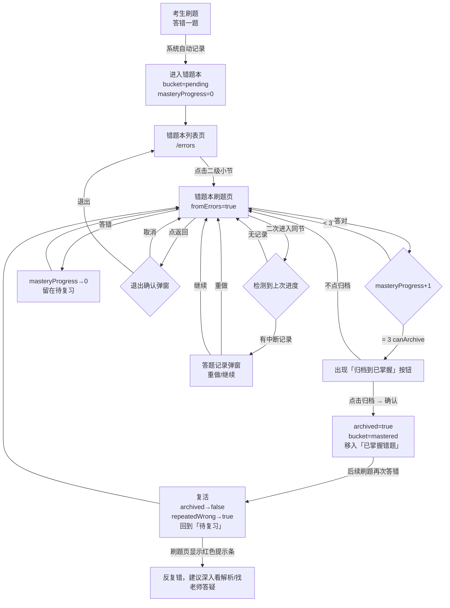

# 错题本功能说明

> 适用范围：FOCO IIQE 前端原型（`前端代码/`）  
> 覆盖入口：`/errors`（错题本列表页）、`/quiz/:mode/:id`（错题本刷题页）  
> 核心数据文件：`src/app/lib/errorBookArchive.ts`

---

## 一、核心设计理念

> **移除不应该是人工操作，而应该是系统根据"掌握证据"自动决策。**

错题本不是一次性"划掉"的清单，而是一个动态的学习追踪系统。题目进入、留存、归档、复活，完全由考生的答题行为驱动，无需手动管理。

---

## 二、题目状态定义

每道题在错题本中持久化以下三个字段（存入 `localStorage`，key `iiqe-error-book-archive-v1`）：

| 字段 | 类型 | 说明 |
|------|------|------|
| `masteryProgress` | `0 / 1 / 2 / 3` | 掌握进度，答对一次 +1，答错归零 |
| `archived` | `boolean` | 是否已由用户确认归档至「已掌握」 |
| `repeatedWrong` | `boolean` | 是否曾从「已掌握」复活回错题本 |

由这三个字段派生出**运行时状态**：

| 派生字段 | 计算逻辑 |
|----------|----------|
| `bucket` | `archived=true` → `mastered`；`masteryProgress≥3` → `archivable`；否则 `pending` |
| `canArchive` | `!archived && masteryProgress≥3` |

---

## 三、掌握进度规则（第一层门槛）

基于 **Leitner System**：一道题不能因为"偶然答对一次"就被移除，必须经过**多次连续答对**才算掌握。

```
masteryProgress 变化规则
┌────────────────────────────┬──────────────────────────────────────┐
│ 事件                        │ 结果                                 │
├────────────────────────────┼──────────────────────────────────────┤
│ 答对（未归档）              │ masteryProgress + 1（上限 3）        │
│ 答错（未归档）              │ masteryProgress → 0，归零重计        │
│ 答对（已归档）              │ 保持原状，不改变                     │
│ 答错（已归档）              │ 复活：masteryProgress → 0，          │
│                             │ archived → false，repeatedWrong → true│
└────────────────────────────┴──────────────────────────────────────┘
```

当 `masteryProgress` 达到 **3** 时，系统认为考生已具备归档条件，刷题页出现「归档到已掌握」按钮。

> **防止短期记忆效应**：`masteryProgress` 仅计入同一次会话或多次 session 内的正确次数。答错一次即全部归零，杜绝"一口气连刷 3 遍"绕过系统。  
> *(注：当前原型未实现 session 间隔检测，此为产品目标，完整版需后端支持。)*

---

## 四、归档机制（第二层门槛）

**系统不自动删除，用户主动确认归档。**

当 `canArchive = true`（即 `masteryProgress≥3` 且未归档）时，刷题页掌握进度卡片底部出现「归档到已掌握」按钮，点击后：

1. 弹出确认弹窗："归档这道题？归档后将移动到「已掌握」，后续答错会自动复活。"
2. 确认后 → `archived = true`，`masteryProgress = 3`，`repeatedWrong = false`
3. 题目移入错题本列表「已掌握错题」分段

不归档的影响：即使 `masteryProgress = 3`，题目仍停留在「待复习」列表中，不会自动消失。这给了考生控制权，也让「归档」这个动作本身具有仪式感与正向反馈。

---

## 五、复活机制（反复错）

> 移除不等于永久删除，「已掌握」档案区随时可能重新激活。

```
已掌握题目在后续刷题中答错
  → masteryProgress 重置为 0
  → archived 重置为 false（回到「待复习」）
  → repeatedWrong 标记为 true
  → 刷题页掌握进度区显示红色提示条：
      "反复错，建议深入看解析/找老师答疑"
```

复活题的识别价值在于：**该题是考生真正的薄弱点**，不是偶然做错，而是曾经"掌握"后再次遗忘，需要更深度的理解。

---

## 六、错题本列表页（`/errors`）

### 入口与筛选

- **按章节**：固定展示 7 章（基础模式）
- **按重要性**：固定展示 4 个题库（冲刺模式：重中之重 / 次重点 / 一般考点 / 补充考点）
- 无论该章/库是否有错题，行项目永远展示（不会"丢项"）

### 分段 Tab

| Tab | 显示内容 |
|-----|---------|
| **待复习** | `bucket = pending` 或 `archivable`（达标未归档也在此） |
| **已掌握错题** | `bucket = mastered`（已归档），积累型，不展示勾选框 |

### 每行展示结构

```
┌─────────────────────────────────────────────────────┐
│ [+/-]  章节/题库名称                        共X题 □  │
│         ─────── 装饰线 ──────────────────────────   │
│         X题还需做对1次  X题还需做对2次  X题反复错     │
│                                                     │
│   •  二级小节名称                           共X题 □  │
│      ─────── 装饰线 ───────────────────────────     │
│      X题还需做对1次  X题还需做对2次  X题反复错        │
└─────────────────────────────────────────────────────┘
```

- 装饰线：固定装饰，不表示进度比例
- 右侧方框（仅「待复习」Tab）：当 `共0题` 时自动变为深蓝填充 + 白色对勾
- 三段灰字数字「X题」加粗，文案固定一行不换行

---

## 七、错题本刷题页

从「待复习」列表点击二级小节进入，进入模式为 `fromErrors = true`，刷题页有以下差异：

### 顶部导航区
与章节刷题 / 分重点刷题样式一致，标题文案为「**错题本**」，副标题为当前章节/题库名。

### 答题后掌握进度卡片
```
┌─────────────────────────────────────┐
│ 掌握进度                   ● ● ○    │
│ 再答对X次即可归档至已掌握            │
│  [归档到已掌握] ← 仅 canArchive 时  │
├─────────────────────────────────────┤  ← 掌握进度圆底"盖住"红条上沿
│ 反复错，建议深入看解析/找老师答疑    │  ← 仅 repeatedWrong=true 时显示
└─────────────────────────────────────┘
```

- 红色提示条无边框，固定高度，被掌握进度圆底覆盖
- 进度点（绿色圆点）：`masteryProgress` 值对应亮起的个数（共 3 个）

### 练习进度恢复（答题记录）
检测到上次练习中断时弹窗：

> **答题记录**  
> 检测到上次练习到第X题，是否继续？  
> 「重做」/ 「继续」

- 进度存储于 `localStorage`（key `iiqe-quiz-progress-v1`）
- 完成本节（最后一题点完成）后自动清除记录

### 退出确认
点返回箭头时弹窗：

> **退出提示**  
> 是否确认退出答题？  
> 「取消」/ 「退出」

---

## 八、操作流程图



---

## 九、数据输入输出关系

```
┌──────────────────────────────────────────────────────────────────────┐
│                         数据层（localStorage）                        │
│                                                                      │
│  iiqe-error-book-archive-v1                                          │
│  ┌─────────────────────────────────────────────────────────────┐     │
│  │ key: "{mode}:{sectionId}:{questionId}"                      │     │
│  │ value: {                                                    │     │
│  │   masteryProgress: 0|1|2|3                                  │     │
│  │   archived: boolean                                         │     │
│  │   repeatedWrong?: boolean                                   │     │
│  │ }                                                           │     │
│  └─────────────────────────────────────────────────────────────┘     │
│                                                                      │
│  iiqe-quiz-progress-v1                                               │
│  ┌─────────────────────────────────────────────────────────────┐     │
│  │ key: "{mode}:{context}:{id}:{sectionName}:{libraryName}"    │     │
│  │ value: number（上次停留题目 index）                           │     │
│  └─────────────────────────────────────────────────────────────┘     │
└──────────────────────────────────────────────────────────────────────┘

输入事件                          输出结果
────────────────────────────────  ────────────────────────────────────
答对（未归档）                 →  masteryProgress +1（上限3）
答错（未归档）                 →  masteryProgress = 0
答错（已归档）                 →  复活：archived=false，repeatedWrong=true
点击「归档到已掌握」并确认      →  archived=true，repeatedWrong=false
完成本节最后一题              →  清除练习进度记录
────────────────────────────────  ────────────────────────────────────

列表页显示逻辑（SectionMasterySummary）
─────────────────────────────────────────────────────────
输入：某节/章/库内所有题目的状态
输出：
  totalInFilter   → 显示「共X题」
  needOneMore     → 显示「X题还需做对1次」
  needTwoMore     → 显示「X题还需做对2次」
  repeatedWrong   → 显示「X题反复错」
  totalInFilter=0 → 右侧方框打勾（待复习 Tab）
```

---

## 十、涉及源码文件

| 文件 | 职责 |
|------|------|
| `src/app/lib/errorBookArchive.ts` | 全部状态读写逻辑、派生计算、统计函数 |
| `src/app/components/ErrorBookPage.tsx` | 错题本列表页（筛选/章节/库展示/统计展示） |
| `src/app/components/QuizPage.tsx` | 错题本刷题页（掌握进度卡片/红色提示条/归档/复活/进度恢复/退出确认） |
| `src/app/components/QuizPracticeCompletePage.tsx` | 完成页（错题回看入口） |

---

*最后更新：2026-06-02*
